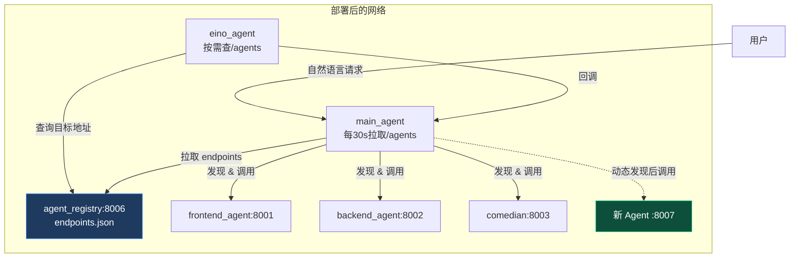

# 使用说明（详细版）

本文档介绍如何从零开始搭建、运行并验证 `adk_swarm` Phase 0 PoC：一个基于 Google ADK + A2A 的多 Agent 前端项目生成平台。

---

## 目录

1. [环境要求](#环境要求)
2. [项目结构](#项目结构)
3. [配置文件](#配置文件)
4. [Docker Compose 一键启动（推荐）](#docker-compose-一键启动推荐)
5. [手动启动（本地开发）](#手动启动本地开发)
6. [交互使用](#交互使用)
7. [验证生成的项目](#验证生成的项目)
8. [常见问题排查](#常见问题排查)
9. [关闭与清理](#关闭与清理)

---

## 环境要求

- **Docker** 29+ 与 **Docker Compose**（一键启动全部服务，推荐）
- **Node.js 22** + **npm 10**（仅在本地开发/编译检查前端子 Agent 时需要）
- **Python 3.11**（仅在本地开发主 Agent 时需要）
- **uv**（推荐，本地开发时创建 Python 虚拟环境）
- 可用的 OpenAI 兼容 API Key（本项目默认使用 `https://open.bigmodel.cn/api/coding/paas/v4`）

---

## 项目结构

```
adk_swarm/
├── .env                          # 配置文件（需自行创建，已 gitignore）
├── docker-compose.yml            # 全部服务编排
├── README.md                     # 项目总览
├── USAGE.md                      # 本文档
├── agent_registry/               # Agent 注册中心（配置中心）
│   ├── endpoints.json            # 所有 Agent 的 endpoints 配置
│   ├── server.py                 # FastAPI 注册中心服务
│   ├── Dockerfile
│   └── README.md
├── frontend_agent/               # Node.js / ADK TypeScript 前端子 Agent
│   ├── Dockerfile
│   ├── package.json
│   ├── tsconfig.json
│   └── src/                      # frontend_agent / generator / builder / packer / server
├── mock_agent/                   # Python mock 后端子 Agent（A2A :8002，联调用）
│   ├── agent.py
│   └── server.py
├── demo_agents/                  # 两个 A2A 子 Agent，验证 orchestrator 路由
│   ├── comedian_server.py        #   :8003 讲笑话专家
│   └── critic_server.py          #   :8004 笑话评论员
├── eino_agent/                   # Go + CloudWeGo Eino Agent
│   ├── main.go
│   ├── Dockerfile
│   └── ...
└── main_agent/                   # Python ADK 主 Agent（orchestrator）
    ├── cli.py                    # 交互式入口（session/思考/工具调用展示/压缩）
    ├── agent.py                  # root agent，从 Registry 动态加载委派工具
    ├── a2a_server.py             # A2A 服务端点（被 eino_agent 等回调）
    ├── session.py                # 基于 SQLite 的 session 持久化
    ├── compression.py            # 上下文超长自动压缩（简单版）
    ├── file_server.py            # FastAPI 静态文件服务
    ├── test_orchestration.py     # orchestrator 多步委派验证（笑话链）
    ├── test_subagent.py          # 前端/后端路由分流验证
    └── requirements.txt          # Python 依赖
```

---

## 配置文件

在项目根目录创建 `.env`，内容如下：

```env
# OpenAI 兼容 API
OPENAI_BASE_URL=https://open.bigmodel.cn/api/coding/paas/v4
OPENAI_API_KEY=<your-key>
OPENAI_MODEL=glm-4.5-air

# A2A 子 Agent 地址（按需配置；没起的服务不影响主 Agent 启动）
FRONTEND_AGENT_URL=http://localhost:8001   # 前端 Agent（Node, Docker）
BACKEND_AGENT_URL=http://localhost:8002    # 后端 mock Agent
COMEDIAN_AGENT_URL=http://localhost:8003   # 讲笑话 demo Agent
CRITIC_AGENT_URL=http://localhost:8004     # 笑话评论 demo Agent

# 主 Agent 文件服务端口
FILE_SERVER_PORT=8080

# Agent Registry 地址（动态发现所有子 Agent，无需重启 main_agent）
AGENT_REGISTRY_URL=http://localhost:8006

# 可选：MCP 工具（JSON 数组，留空则不加载）
# MCP_SERVERS='[{"transport":"stdio","command":"npx","args":["-y","@modelcontextprotocol/server-filesystem","."]}]'
```

> 注意：`.env` 已加入 `.gitignore`，不会进入版本控制。
>
> 架构说明：主 Agent 是 **orchestrator**。每个 A2A 子 Agent 在主 Agent 内被包成一个
> 委派工具（`AgentTool`），其 `description` 成为工具描述。主 Agent 的 LLM 读这些描述，
> **自主判断**该把任务派给谁、什么顺序，调用后拿回结果继续推理——不是流水线，不是写死的路由。
>
> 所有 Agent 的 endpoint 现在统一由 **Agent Registry** 管理。新增 Agent 时只需改
> `agent_registry/endpoints.json`， orchestrator 会动态刷新工具列表，**无需重启业务 Agent**。

---

## Docker Compose 一键启动（推荐）

所有服务（前端 Agent、主 Agent、后端 mock、demo 子 Agent）已全部容器化，通过一个 `docker compose` 命令即可启动整个集群。

### 1. 确认 .env 已配置

确保项目根目录的 `.env` 已填写有效的 API Key：

```env
OPENAI_BASE_URL=https://open.bigmodel.cn/api/coding/paas/v4
OPENAI_API_KEY=<your-key>
OPENAI_MODEL=glm-4.5-air
```

### 2. 构建并启动所有服务

```bash
docker compose up -d --build
```

这将启动 6 个服务：

| 服务 | 容器名 | 端口 | 说明 |
|------|--------|------|------|
| agent_registry | adk_swarm-agent_registry-1 | 8006 | Agent 注册中心（endpoints 配置） |
| frontend_agent | adk_swarm-frontend_agent-1 | 8001 | 前端项目生成 |
| main_agent | adk_swarm-main_agent-1 | 8080 / 8081 | 主 Orchestrator / A2A 回调端点 |
| mock_agent | adk_swarm-mock_agent-1 | 8002 | 后端 mock |
| comedian | adk_swarm-comedian-1 | 8003 | 讲笑话 demo |
| critic | adk_swarm-critic-1 | 8004 | 笑话评论 demo |
| eino_agent | adk_swarm-eino_agent-1 | 8005 | Go 天气 / 双向调度 |

Compose 内建 healthcheck 和 `depends_on`，主 Agent 会等 registry 和其他子 Agent 就绪后再启动。

### 3. 确认所有服务健康

```bash
docker compose ps
```

应全部显示 `healthy`：

```
NAME                         STATUS
adk_swarm-frontend_agent-1   Up (healthy)
adk_swarm-main_agent-1       Up
adk_swarm-mock_agent-1       Up (healthy)
adk_swarm-comedian-1         Up (healthy)
adk_swarm-critic-1           Up (healthy)
```

也可以逐个验证 A2A Agent Card：

```bash
curl -s http://localhost:8006/agents | python3 -c "import sys,json; print([a['name'] for a in json.load(sys.stdin)['agents']])"
curl -s http://localhost:8001/.well-known/agent-card.json | python3 -c "import sys,json; print(json.load(sys.stdin)['name'])"
curl -s http://localhost:8002/.well-known/agent-card.json | python3 -c "import sys,json; print(json.load(sys.stdin)['name'])"
curl -s http://localhost:8003/.well-known/agent-card.json | python3 -c "import sys,json; print(json.load(sys.stdin)['name'])"
curl -s http://localhost:8004/.well-known/agent-card.json | python3 -c "import sys,json; print(json.load(sys.stdin)['name'])"
curl -s http://localhost:8005/.well-known/agent-card.json | python3 -c "import sys,json; print(json.load(sys.stdin)['name'])"
```

### 4. 进入主 Agent 交互式 CLI

主 Agent 容器以 `sleep infinity` 保持运行，通过 `exec` 进入交互：

```bash
docker compose exec main_agent python cli.py
```

> 注意：如果本地 `python` 指向 Python 2，可能需要 `docker compose exec main_agent python3 cli.py`。

**可用命令：** `/sessions` `/resume <id>` `/new` `/history` `/compact` `/help` `/quit`

### 5. 查看日志

```bash
# 所有服务
docker compose logs -f

# 指定服务
docker compose logs -f frontend_agent
docker compose logs -f main_agent
```

---

## 动态接入新 Agent（无需重启）

本项目的核心是 **Agent Registry**（`agent_registry/`）。它不是一个复杂的分布式注册中心，而是一个极轻量的 HTTP 配置服务：只把 `agent_registry/endpoints.json` 里的 endpoints 暴露出来，供所有调度型 Agent 读取。

### 为什么能做到“不重启加 Agent”

- `main_agent` 启动后，会每 30 秒向 `AGENT_REGISTRY_URL/agents` 拉取一次 endpoints list。
- 拉取到新配置后，自动用新的 Agent 描述重建自己的委派工具列表和 `root_agent`。
- 新打开的 CLI session（或新 A2A 请求）会立即使用最新的工具列表。
- `eino_agent` 在首次需要调用 `main_agent` / `comedian_agent` 时，也会先读 Registry，再决定调谁。

所以新增 Agent 只需两步：

1. 把新 Agent 的 endpoint 加到 `agent_registry/endpoints.json`。
2. 调用 `POST /reload` 让 Registry 重新加载（因为 `endpoints.json` 是 volume 挂载的，改完即可重载）。

```bash
# 1. 编辑 agent_registry/endpoints.json，追加一个新 Agent
# 2. 通知 Registry 重新加载
curl -X POST http://localhost:8006/reload
```

约 30 秒内，`main_agent` 和 `eino_agent` 就会发现它。新 session 里直接可以说：

```
让 new_agent 帮我做 xxx
```

### 流程图



### endpoints.json 配置示例

```json
{
  "agents": [
    {
      "name": "frontend_agent",
      "url": "http://frontend_agent:8001",
      "description": "前端项目生成专家...",
      "type": "specialist"
    },
    {
      "name": "new_orchestrator",
      "url": "http://new_orchestrator:8007",
      "description": "一个二级调度 Agent，擅长把复杂任务拆给多个专家。",
      "type": "orchestrator"
    }
  ]
}
```

> **注意**：`type` 字段目前只是标注，不影响路由。真正影响 main_agent 调度的是 `description` —— LLM 通过描述判断这个 Agent 适合什么任务。

---

## 手动启动（本地开发）

前端子 Agent 运行在 Docker 容器中，与主 Agent 通过 HTTP/A2A 通信。

### 1. 本地编译检查（可选但推荐）

```bash
cd frontend_agent
npm install
npm run build
```

如果 `npm run build` 没有报错，说明 TypeScript 类型检查通过。

### 2. 构建并启动容器

```bash
cd ..                          # 回到项目根目录
docker compose up -d --build
```

构建过程会执行 `npm ci` 与 `npm run build`，首次可能较慢。

### 3. 确认服务正常

```bash
curl http://localhost:8001/.well-known/agent-card.json
```

应返回 JSON 格式的 Agent Card，包含 `name: frontend_agent` 与 A2A 端点信息。

### 4. 查看日志

```bash
docker compose logs -f
```

---

## 启动 A2A 子 Agent（mock / demo）

主 Agent 是 orchestrator，下面挂的子 Agent 都是独立的 A2A 服务。按需启动（没起的不影响主 Agent 启动，只在实际调用到时才报连不上）。所有子 Agent 复用 `main_agent` 的虚拟环境。

### 1. 后端 mock Agent（:8002，联调用）

```bash
cd mock_agent
source ../main_agent/.venv/bin/activate
python server.py
```

验证：`curl http://localhost:8002/.well-known/agent-card.json` 应返回 `name: backend_agent`。

### 2. demo 子 Agent（:8003 :8004，验证 orchestrator 路由用）

这两个 Agent（讲笑话、笑话评价）专门用来验证主 Agent 的自主路由能力——比如「让喜剧演员讲个笑话，再让评论员评价」这类需要主 Agent 自己判断先调谁、后调谁的复合任务。

```bash
cd demo_agents
source ../main_agent/.venv/bin/activate
python comedian_server.py   # 终端 A，:8003 讲笑话专家
python critic_server.py     # 终端 B，:8004 笑话评论员
```

验证：`curl http://localhost:8003/.well-known/agent-card.json`、`:8004`。

> 这些 demo/mock 都是占位。等真实第三方 Agent 暴露 A2A 端点后，把 `.env` 里对应的
> `*_AGENT_URL` 指过去，再在 `main_agent/agent.py` 的 `_build_delegate_tools` 加一行 spec 即可，主 Agent 侧无需改路由逻辑。

---

## 启动主 Agent

### 1. 创建并激活 Python 虚拟环境

```bash
cd main_agent
uv venv --python python3.11 .venv
source .venv/bin/activate
```

### 2. 安装依赖

```bash
uv pip install -r requirements.txt
```

如果 `uv` 安装 `google-adk[extensions]` 超时，可以先单独安装 `litellm`：

```bash
uv pip install litellm
```

### 3. 运行方式一：交互式 CLI（推荐，主要使用方式）

```bash
python cli.py
```

这是项目的主要入口。它提供：
- **session 持久化**：对话存到本地 SQLite，可跨进程恢复（`/resume <id>`）。
- **思考展示**：实时显示 LLM 的推理过程（💭）。
- **工具调用展示**：实时显示每次工具调用（🔧）和返回（↩️），包括对子 Agent 的委派。
- **上下文压缩**：对话过长时提示并支持 `/compact` 摘要。
- **MCP 工具**：配置了 `MCP_SERVERS` 即自动加载。

CLI 内命令：`/sessions` `/resume <id>` `/new` `/history` `/compact` `/help` `/quit`。

> 注意：必须在 `main_agent` 目录下运行（`agent.py` 会 `from file_server import ...`，依赖当前工作目录的模块查找）。如需恢复某个 session：`python cli.py --session <id>`。

### 4. 运行方式二：ADK 自带 CLI / Web UI

```bash
adk run .      # ADK 交互式 CLI
adk web .      # Web UI，浏览器打开提示地址
```

这两种方式也能跑，但不会展示自定义的思考/工具渲染，也没有 session 持久化。推荐用方式一的 `cli.py`。

### 5. 运行方式三：非交互式验证脚本

```bash
python test_orchestration.py   # 验证 orchestrator 多步委派（笑话链）
python test_subagent.py        # 验证前端/后端路由分流
```

适合 CI 或快速回归。会打印主 Agent 实际调用了哪些子 Agent 工具，确认路由正确。

---

## 交互使用

启动 `python cli.py` 后，主 Agent 会根据任务性质**自主路由**。试这些：

```
帮我做一个 TODO 页面
```
→ 主 Agent 调用 `generate_frontend_project` 委派前端子 Agent，返回下载链接：
```
http://localhost:8080/artifacts/<session-id>/project.tar.gz
```

```
帮我写一个 FastAPI 的用户注册登录接口
```
→ 主 Agent 判断这是后端任务，委派 backend_agent，返回接口规格。

```
让喜剧演员讲个关于程序员的笑话，再让评论员评价
```
→ 主 Agent **自主判断**先调 comedian_agent 拿笑话、再调 critic_agent 评价，最后综合回复。调用顺序是它临场判断的，不是写死的。

```
现在几点
```
→ 调内置工具 `get_current_time`。

过程中你会看到 🔧 工具调用、↩️ 返回、💭 思考实时打印。下载链接可复制到浏览器或：

```bash
curl -O http://localhost:8080/artifacts/<session-id>/project.tar.gz
```

---

## 验证生成的项目

下载 `project.tar.gz` 后：

```bash
mkdir todo_app && cd todo_app
tar -xzf /path/to/project.tar.gz
npm install
npm run dev
```

浏览器访问 `http://localhost:5173`，应能看到 TODO 页面正常工作。

> 前端子 Agent 在容器内部已经完成了 `npm install`、`npm run build` 和 dev server 200 校验，因此解压后的项目应当是可直接运行的。

---

## 常见问题排查

### 1. 前端 Agent 返回 `package.json` 缺失

这是部分 LLM 会把 `package.json` 截断成 `package.` 的已知现象。代码中已做兜底：如果生成的文件里只有 `package.`，会自动重命名为 `package.json`。如果仍然失败，请检查 `frontend_agent/src/generator.ts` 的日志。

### 2. Dev server 验证失败

容器内 `localhost` 可能解析到 IPv6，而 Vite 默认只绑定 IPv4。代码中已强制使用 `--host 127.0.0.1` 并用 `http://127.0.0.1:5173` 轮询。如果仍然失败，检查：

```bash
docker compose logs -f
```

看是否有端口占用或 build 报错。

### 3. 主 Agent 文件服务无法访问

`agent.py` 在模块导入时会自动在后台线程启动 FastAPI 文件服务。只要主 Agent 进程在运行，`http://localhost:8080/artifacts/` 就应可访问。如果退出 `adk run`，文件服务也会停止，但已生成的文件仍保留在 `main_agent/artifacts/` 中。

### 4. A2A 调用返回 `Method not found`

本项目使用 `@a2a-js/sdk` 暴露的 A2A 端点，发送方法为 `message/send`，端点为 `/jsonrpc`。不要直接使用标准 A2A 草案中的 `tasks/send`。

### 5. Python 依赖安装慢或失败

如果 `uv pip install -r requirements.txt` 长时间无响应，建议：

```bash
uv pip install google-adk[a2a]
uv pip install litellm
uv pip install fastapi uvicorn[standard] python-dotenv requests
```

分步安装。

---

## Kubernetes 部署清单

把 `docker-compose.yml` 这套服务搬到 K8s 时，最小需要部署的资源如下：

| 组件 | K8s 资源 | 说明 |
|---|---|---|
| agent_registry | Deployment + Service | 注册中心，建议 1 副本即可 |
| main_agent | Deployment + Service | 2 个端口：8080（web/CLI）、8081（A2A） |
| frontend_agent | Deployment + Service | Node/TypeScript |
| mock_agent | Deployment + Service | Python 后端 mock |
| comedian / critic | Deployment + Service | Demo 子 Agent |
| eino_agent | Deployment + Service | Go Agent |
| 新 Agent | Deployment + Service | 热插拔，无需改 main_agent |
| 共享配置 | ConfigMap + Secret | 模型地址、API Key、Registry URL |
| 持久化 | PVC | sessions、artifacts |
| Ingress（可选） | Ingress / Gateway | 对外暴露 main_agent 8080 |

### 关键配置原则

1. **所有 Pod 都要能访问 agent_registry Service**
   - 环境变量：`AGENT_REGISTRY_URL=http://agent-registry:8006`
   - 内部 DNS 用 K8s Service 名，不要用 `localhost`。

2. **新增 Agent 时只需做 3 件事**
   - 写新的 Deployment + Service。
   - 更新 `agent_registry` 的 ConfigMap（即 `endpoints.json`）。
   - 调用 `POST http://agent-registry:8006/reload`。
   - `main_agent` 和 `eino_agent` 会在下次拉取时发现新 Agent，**无需滚动重启业务 Deployment**。

3. **健康检查**
   - 所有 A2A Agent 暴露 `/.well-known/agent-card.json`。
   - Registry 暴露 `/health`。
   - K8s `livenessProbe` / `readinessProbe` 可以直接用这两个端点。

### 简易 K8s 示例（agent_registry）

```yaml
apiVersion: apps/v1
kind: Deployment
metadata:
  name: agent-registry
spec:
  replicas: 1
  selector:
    matchLabels:
      app: agent-registry
  template:
    metadata:
      labels:
        app: agent-registry
    spec:
      containers:
        - name: registry
          image: your-registry/adk_swarm:agent_registry
          ports:
            - containerPort: 8006
          envFrom:
            - secretRef:
                name: adk-secrets
          volumeMounts:
            - name: endpoints
              mountPath: /app/endpoints.json
              subPath: endpoints.json
          livenessProbe:
            httpGet:
              path: /health
              port: 8006
      volumes:
        - name: endpoints
          configMap:
            name: agent-registry-config
---
apiVersion: v1
kind: Service
metadata:
  name: agent-registry
spec:
  selector:
    app: agent-registry
  ports:
    - port: 8006
      targetPort: 8006
```

ConfigMap 里放 `endpoints.json` 内容。更新 ConfigMap 后调用 `/reload`，调度者即感知。

---

## 调试与 Trace

### 当前状态

- `main_agent` 自带最完整的调试界面：CLI 实时打印 💭 思考、🔧 工具调用、↩️ 返回。
- `eino_agent` 自带 Dev Web UI：`http://localhost:8005/ui`。
- 其他子 Agent 主要通过 `docker compose logs -f <service>` 查看 stdout 日志。

### 推荐的最小可观测性方案（K8s）

因为各 Agent 是独立进程，**跨 Agent 调用链需要统一的日志 + trace**：

| 层级 | 组件 | 用途 |
|---|---|---|
| 日志收集 | Fluent Bit / Fluentd | 把所有 Pod 的 stdout 日志打到后端 |
| 日志存储/查询 | Loki 或 ELK | 按 `session_id` / `trace_id` 关联 |
| 可视化 | Grafana | 查日志、看调用链 |
| 分布式 Trace（可选） | OpenTelemetry Collector + Jaeger/Tempo | 跟踪 `main_agent -> eino_agent -> main_agent` 这类跨 Agent 调用 |

### 最简单的调试姿势（Compose 环境）

```bash
# 1. 看 Registry 当前有哪些 Agent
curl -s http://localhost:8006/agents | python3 -m json.tool

# 2. 看 main_agent 有没有动态刷新到新 Agent
docker compose logs -f main_agent | grep "registry\|delegate tools"

# 3. 看 eino_agent 调用链
docker compose logs -f eino_agent

# 4. 直接进 main_agent CLI 手动触发
docker compose exec main_agent python cli.py
```

> **Trace 说明**：当前代码主要靠日志输出进行调试。如果后续需要完整的分布式 trace，建议给每个 A2A 调用注入 OpenTelemetry span，并通过 HTTP header 传递 `traceparent`，在 Grafana/Jaeger 中查看整条链路。

---

## 关闭与清理

### 停止所有服务

```bash
docker compose down
```

### 停止并删除 volumes（会丢失 session 历史和 artifacts）

```bash
docker compose down -v
```

> 数据持久化：session 历史（SQLite）和生成的项目文件存储在 named volume 中，
> `docker compose down` 不会删除它们。只有 `docker compose down -v` 才会清空。

### 查看存储占用

```bash
docker system df
```

### 手动启动方式下的清理

```bash
rm -rf main_agent/artifacts/*
cd main_agent && rm -rf .venv
```

---

## 下一步建议

- 接入更多子 Agent（后端、数据库、测试、代码审查等）——只需改 `agent_registry/endpoints.json`。
- 为 Agent Registry 增加写接口或 GitOps 同步，实现配置变更自动生效。
- 为主 Agent 增加任务级日志与审计记录。
- 接入 OpenTelemetry，实现跨 Agent 的分布式 trace。
- 增加工作流模板，支持“生成前端 + 生成后端 + 联调”等组合任务。
