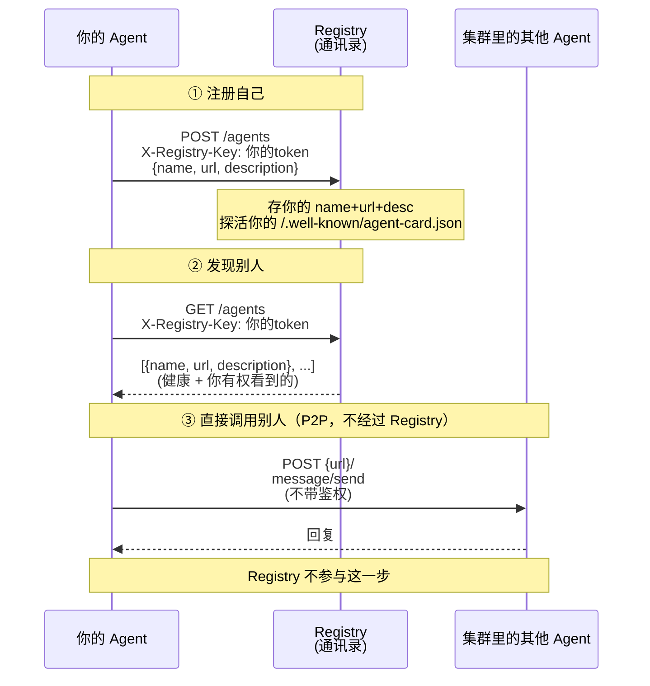
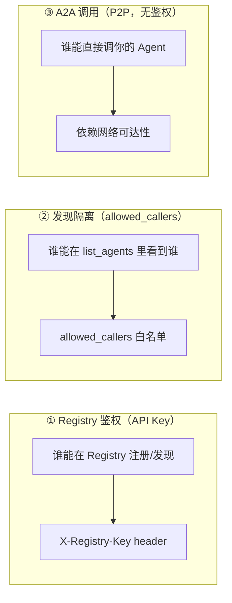

# Agent 接入 Registry 指南

> 本文档面向**想把新 Agent 接入集群**的开发者。无论你的 Agent 是 Python 还是 Go
> 写的，照着做就能让它被 Registry 发现、也能调用集群里的其他 Agent。
>
> **Go (Eino) Agent 的接入是重点**，单独有一章详细说明，因为团队的大部分新 Agent
> 会用 CloudWeGo Eino 框架开发。

---

## 目录

- [架构概览](#架构概览)
- [两条接入路径：REST vs MCP](#两条接入路径rest-vs-mcp)
- [准备：分配 Token + 实现 A2A Server](#准备分配-token--实现-a2a-server)
- [运行时：注册自己 + 发现别人 + 调用别人](#运行时注册自己--发现别人--调用别人)
- [Go (Eino) Agent 接入详解](#go-eino-agent-接入详解-) ⭐ 重点
- [Python Agent 接入](#python-agent-接入)
- [Docker Compose 配置](#docker-compose-配置)
- [安全模型](#安全模型)
- [常见问题](#常见问题)

---

## 架构概览



**关键理解**：
- Registry 是**通讯录**，不是中转站。你从 Registry 拿到别人的地址后，**直接连对方**。
- 注册和发现都需要**鉴权**（API Key）。
- Agent 之间的 A2A 调用**不需要经过 Registry**，是 P2P 直连。

---

## 两条接入路径：REST vs MCP

Registry 同时暴露了两套接口，你的 Agent **选一种就行**：

| | REST | MCP (SSE) |
|---|---|---|
| **端点** | `http://registry:8006/agents` | `http://registry:8006/sse` |
| **鉴权** | HTTP header `X-Registry-Key` | 建连时 header + 工具参数 `caller_id`/`caller_key` |
| **操作** | REST CRUD（GET/POST/PUT/DELETE） | MCP 工具（`register_agent`/`list_agents`） |
| **适合** | Python agent（用 `requests` 库）、脚本、运维 | Go agent（用 `mark3labs/mcp-go`）、任何 MCP 客户端 |
| **我们项目里谁用** | main_agent、demo agents（Python） | eino_agent（Go） |

> **为什么有两种？** Registry 本身同时是 FastAPI 服务（REST）和 MCP Server（SSE）。
> Python 生态用 REST 最直接；Go 生态用 MCP 客户端更自然（`mcp-go` 库成熟）。
> 两条路径功能完全等价——同一个 Registry，两种调用方式。

---

## 准备：分配 Token + 实现 A2A Server

这两件事**互相独立**，可以并行做：

### 准备 A：分配 Token（让 Registry 认识你）

每个 Agent 需要一个 **API Key（Token）** 才能访问 Registry。有两种方式获取：

**方式一：管理员预置（推荐，适合已知 Agent）**

在 `.env` 文件里加两行：

```bash
# 1. 定义这个 agent 的 key（取一个随机字符串）
REGISTRY_KEY_MY_AGENT=<一个随机字符串>

# 2. 把它加到 SEEDS 列表里（逗号分隔）
# 格式：client_id:key,client_id:key,...
# 如果是管理员，client_id 后面加 *
REGISTRY_CALLER_SEEDS=admin*:xxx,main_agent:yyy,...,my_agent:<和上面一样的随机字符串>
```

重启 Registry 后，你的 caller 身份就生效了。

**方式二：管理员运行时添加（不用重启）**

```bash
# 管理员调 POST /callers，不传 key 则自动生成
curl -X POST http://registry:8006/callers \
  -H "X-Registry-Key: <管理员token>" \
  -H "Content-Type: application/json" \
  -d '{"client_id": "my_agent"}'

# 返回（key 只出现这一次，保存好）：
# {"client_id":"my_agent","is_admin":false,"key":"aU3xK9mP自动生成的随机串"}
```

> **Token 轮换**：如果 token 泄露，管理员可以重置：
> `curl -X PUT http://registry:8006/callers/my_agent/key -H "X-Registry-Key: <管理员token>"`
> 旧 key 立即失效，返回新 key。

### 准备 B：实现 A2A Server（让别人能调用你）

你的 Agent 必须是一个**合规的 A2A Server**——暴露两个东西：

**1. Agent Card（必须）**

在 `GET /.well-known/agent-card.json` 返回你的"名片"：

```json
{
  "name": "my_agent",
  "description": "我是做什么的 agent（这段文字决定了别的 agent 是否会调用你）",
  "url": "http://my_agent:9000",
  "version": "1.0.0",
  "capabilities": {},
  "skills": []
}
```

> **⚠️ 重要**：`name` 字段必须和你在 Registry 里注册的 name **完全一致**。
> Registry 探活时会检查 card 里的 name 是否匹配，不匹配会被标记为"不可信"。
>
> **好消息**：`description` 改了不用重新注册——Registry 探活时会自动从 card 同步。

**2. message/send 处理（必须）**

接受 JSON-RPC 2.0 的 `message/send` 请求：

```json
{
  "jsonrpc": "2.0",
  "id": "请求ID",
  "method": "message/send",
  "params": {
    "message": {
      "messageId": "xxx",
      "role": "user",
      "parts": [{"kind": "text", "text": "用户发来的消息"}]
    }
  }
}
```

返回结果：

```json
{
  "jsonrpc": "2.0",
  "id": "请求ID",
  "result": {
    "messageId": "yyy",
    "role": "agent",
    "parts": [{"kind": "text", "text": "你的回复"}]
  }
}
```

> 调用方会先试 `POST {url}/`，再试 `POST {url}/jsonrpc`。两个路径都接，或者只接 `/`
> 都行（ADK 默认挂在 `/`）。

> **Go/Eino 开发者注意**：Eino 框架**不自带** A2A server，需要你自己实现 HTTP handler
> （agent card + message/send 的 JSON-RPC 处理）。Go 章节有完整代码。

---

## 运行时：注册自己 + 发现别人 + 调用别人

### 注册自己到 Registry

启动时，向 Registry 声明"我在哪"：

**REST 方式（Python / curl）：**
```bash
curl -X POST http://registry:8006/agents \
  -H "X-Registry-Key: <你的token>" \
  -H "Content-Type: application/json" \
  -d '{
    "name": "my_agent",
    "url": "http://my_agent:9000",
    "description": "我是做什么的",
    "type": "specialist"
  }'
```

**MCP 方式（Go）：** 见 [Go 章节](#go-eino-agent-接入详解-) 的 `RegisterSelf`。

> - **幂等**：如果已存在（同名），Registry 会**更新**你的信息（upsert），不报错。
> - **乐观标记**：注册时默认标记为"健康"，下次探活（60秒）会验证。
> - **探活**：Registry 每 60 秒 GET 你的 `/.well-known/agent-card.json`，通了就算健康。

### 发现集群里的其他 Agent

**REST 方式：**
```bash
curl http://registry:8006/agents \
  -H "X-Registry-Key: <你的token>"

# 返回（只有健康 + 你有权看到的 agent）：
# {"agents": [{"name":"comedian_agent","url":"http://comedian:8003","description":"..."}, ...]}
```

**MCP 方式（Go）：** 见 Go 章节的 `ListAgents`。

### 调用其他 Agent（A2A P2P 直连）

拿到别人的 `url` 后，直接发 `message/send`：

```bash
curl -X POST http://comedian:8003/ \
  -H "Content-Type: application/json" \
  -d '{
    "jsonrpc": "2.0",
    "id": "1",
    "method": "message/send",
    "params": {
      "message": {
        "messageId": "msg-001",
        "role": "user",
        "parts": [{"kind": "text", "text": "讲个笑话"}]
      }
    }
  }'
```

> **注意**：这一步**不带任何鉴权 header**。A2A 是 P2P 协议，鉴权只发生在你和
> Registry 之间。详见 [安全模型](#安全模型)。

---

## Go (Eino) Agent 接入详解 ⭐

> 这一章是**重点**。如果你用 CloudWeGo Eino 框架开发 Go Agent，照着这里做就行。
> 下面的代码全部来自项目里 `eino_agent/main.go` 的真实实现。

### 前置知识：Eino ADK

[Eino ADK](https://www.cloudwego.io/docs/eino/overview/eino_adk0_1/) 是 CloudWeGo
（字节跳动）开源的 Go 语言 Agent 开发框架，参考了 Google ADK 的架构设计。核心组件：

- **`ChatModelAgent`**：ReAct 模式的 LLM Agent（思考→行动→观察→再思考）
- **`WorkflowAgent`**：Sequential / Parallel / Loop 工作流编排
- **预置多 Agent 模式**：Supervisor（集中协调）、PlanExecute（规划-执行-重规划）、
  DeepAgents（深度任务分解）
- **调试**：可视化调试插件

> **重要**：Eino ADK 负责你的 Agent 的"大脑"（LLM 推理、工具调用、编排）。
> 但 **A2A Server（让别人能通过网络调用你）需要你自己实现**——Eino 不自带 HTTP server。
> 下面会给出完整代码。

### 依赖

```bash
go get github.com/cloudwego/eino@latest
go get github.com/mark3labs/mcp-go@v0.43.0
```

`go.mod` 关键依赖：

```
require (
    github.com/cloudwego/eino v0.8.11
    github.com/mark3labs/mcp-go v0.43.0    // MCP 客户端，用于连 Registry
)
```

### 完整接入步骤

#### 1. 实现 A2A Server（让别人能调用你）

Eino 不自带 A2A server，你需要自己写 HTTP handler：

```go
// --- A2A Server ---

type Server struct {
    agent *adk.ChatModelAgent
    card  AgentCard
}

// Agent Card 名片
type AgentCard struct {
    Name        string `json:"name"`
    Description string `json:"description"`
    URL         string `json:"url"`
    Version     string `json:"version"`
}

func (s *Server) ServeHTTP(w http.ResponseWriter, r *http.Request) {
    switch {
    case r.URL.Path == "/.well-known/agent-card.json" && r.Method == http.MethodGet:
        // ① 返回你的名片
        w.Header().Set("Content-Type", "application/json")
        json.NewEncoder(w).Encode(s.card)

    case r.URL.Path == "/" && r.Method == http.MethodPost:
        // ② 处理 message/send
        s.handleA2A(w, r)

    default:
        http.NotFound(w, r)
    }
}

func (s *Server) handleA2A(w http.ResponseWriter, r *http.Request) {
    var req struct {
        JSONRPC string                 `json:"jsonrpc"`
        Method  string                 `json:"method"`
        Params  map[string]interface{} `json:"params"`
    }
    json.NewDecoder(r.Body).Decode(&req)

    if req.Method != "message/send" {
        http.Error(w, "method not found", http.StatusNotFound)
        return
    }

    // 从 params.message.parts 提取用户消息
    msg := req.Params["message"].(map[string]interface{})
    parts := msg["parts"].([]interface{})
    var userText string
    for _, p := range parts {
        if part, ok := p.(map[string]interface{}); ok {
            if t, ok := part["text"].(string); ok {
                userText = t
                break
            }
        }
    }

    // 调用你的 Eino Agent 处理
    reply := runAgent(r.Context(), s.agent, userText)

    // 返回 JSON-RPC 结果
    json.NewEncoder(w).Encode(map[string]interface{}{
        "jsonrpc": "2.0",
        "result": map[string]interface{}{
            "messageId": uuid.New().String(),
            "role":      "agent",
            "parts":     []map[string]string{{"kind": "text", "text": reply}},
        },
    })
}
```

#### 2. 定义 Registry 客户端（连接 Registry，发现+注册）

Registry 通过 MCP 协议暴露 `register_agent` 和 `list_agents` 两个工具。
你的 Go Agent 用 `mark3labs/mcp-go` 客户端连接它：

```go
import (
    mcpclient "github.com/mark3labs/mcp-go/client"
    "github.com/mark3labs/mcp-go/client/transport"
    "github.com/mark3labs/mcp-go/mcp"
)

type RegistryClient struct {
    cli       *mcpclient.Client
    callerID  string  // 你的身份，如 "my_agent"（从 REGISTRY_CLIENT_ID 读）
    callerKey string  // 你的 API Key（从 REGISTRY_CLIENT_KEY 读）
}

func NewRegistryClient(ctx context.Context, registryURL, callerID, callerKey string) (*RegistryClient, error) {
    sseURL := strings.TrimRight(registryURL, "/") + "/sse"

    // 建立连接时带上 API Key（SSE 连接级 header）
    opts := []transport.ClientOption{}
    if callerKey != "" {
        opts = append(opts, mcpclient.WithHeaders(map[string]string{
            "X-Registry-Key": callerKey,
        }))
    }

    cli, err := mcpclient.NewSSEMCPClient(sseURL, opts...)
    if err != nil {
        return nil, fmt.Errorf("create SSE client: %w", err)
    }

    // ⚠️ 必须先 Start 再 Initialize（SSE 的特殊要求）
    if err := cli.Start(ctx); err != nil {
        return nil, fmt.Errorf("start SSE client: %w", err)
    }

    initReq := mcp.InitializeRequest{}
    initReq.Params.ProtocolVersion = mcp.LATEST_PROTOCOL_VERSION
    initReq.Params.ClientInfo = mcp.Implementation{Name: callerID, Version: "1.0.0"}
    if _, err := cli.Initialize(ctx, initReq); err != nil {
        return nil, fmt.Errorf("initialize MCP session: %w", err)
    }

    return &RegistryClient{cli: cli, callerID: callerID, callerKey: callerKey}, nil
}
```

> **易错点**：`Start(ctx)` 必须在 `Initialize(ctx, initReq)` 之前调用，否则连接失败。
> 这是 SSE transport 的固定顺序。

#### 3. 注册自己

```go
func (rc *RegistryClient) RegisterSelf(ctx context.Context, name, url, description, agentType string) {
    req := mcp.CallToolRequest{}
    req.Params.Name = "register_agent"
    req.Params.Arguments = map[string]any{
        "caller_id":   rc.callerID,    // 你的身份
        "caller_key":  rc.callerKey,    // 你的 API Key（MCP 工具要求显式传）
        "name":        name,            // agent 名字
        "url":         url,             // 你的 A2A 地址
        "description": description,     // 你是做什么的
        "type":        agentType,       // "specialist" 或 "orchestrator"
    }
    _, err := rc.cli.CallTool(ctx, req)
    if err != nil {
        log.Printf("self-registration failed (non-fatal): %v", err)
        return
    }
    log.Printf("registered self as %q @ %s", name, url)
}
```

> **为什么 MCP 工具要传 caller_id + caller_key？**
> 因为 SSE 通道在建立连接后，每次 tool call 拿不到 HTTP header。
> 所以 MCP 工具要求你显式传这两个参数来验证身份。

#### 4. 发现集群里的其他 Agent

```go
type AgentEntry struct {
    Name        string `json:"name"`
    URL         string `json:"url"`
    Description string `json:"description"`
    Type        string `json:"type"`
}

func (rc *RegistryClient) ListAgents(ctx context.Context, selfName string) []AgentEntry {
    req := mcp.CallToolRequest{}
    req.Params.Name = "list_agents"
    req.Params.Arguments = map[string]any{
        "caller_id":  rc.callerID,
        "caller_key": rc.callerKey,
    }
    res, err := rc.cli.CallTool(ctx, req)
    if err != nil {
        log.Printf("list_agents failed: %v", err)
        return nil
    }

    // MCP 工具返回 content[].text，里面是 JSON：{"agents": [...]}
    var out []AgentEntry
    for _, c := range res.Content {
        if tc, ok := c.(mcp.TextContent); ok && tc.Text != "" {
            var payload struct {
                Agents []AgentEntry `json:"agents"`
            }
            if err := json.Unmarshal([]byte(tc.Text), &payload); err == nil {
                out = append(out, payload.Agents...)
            }
        }
    }
    // 过滤掉自己
    filtered := out[:0]
    for _, a := range out {
        if a.Name != selfName {
            filtered = append(filtered, a)
        }
    }
    return filtered
}
```

#### 5. 调用其他 Agent（A2A P2P 直连）

拿到别人的 URL 后，直接发 JSON-RPC：

```go
var a2aClient = &http.Client{Timeout: 120 * time.Second}

func callA2AAgent(baseURL, message string) (string, error) {
    payload := map[string]interface{}{
        "jsonrpc": "2.0",
        "id":      uuid.New().String(),
        "method":  "message/send",
        "params": map[string]interface{}{
            "message": map[string]interface{}{
                "messageId": uuid.New().String(),
                "role":      "user",
                "parts": []map[string]interface{}{
                    {"kind": "text", "text": message},
                },
            },
        },
    }
    body, _ := json.Marshal(payload)

    // 双端点兜底：先试 / 再试 /jsonrpc
    endpoints := []string{
        strings.TrimRight(baseURL, "/") + "/",
        strings.TrimRight(baseURL, "/") + "/jsonrpc",
    }
    for _, ep := range endpoints {
        resp, err := a2aClient.Post(ep, "application/json", bytes.NewReader(body))
        if err != nil {
            continue
        }
        defer resp.Body.Close()
        var rpcResp map[string]interface{}
        json.NewDecoder(resp.Body).Decode(&rpcResp)
        if result, ok := rpcResp["result"]; ok {
            return extractText(result), nil
        }
    }
    return "", fmt.Errorf("failed to call A2A agent at %s", baseURL)
}
```

> **注意**：A2A 调用**不带任何鉴权 header**。鉴权只发生在你与 Registry 的通信中。
> 详见 [安全模型](#安全模型)。

#### 6. 把调用能力暴露给你的 Agent 的 LLM

如果你用 Eino 的 `ChatModelAgent`，可以把"调用集群里的其他 agent"做成 LLM 工具：

```go
import (
    "github.com/cloudwego/eino/components/tool"
    "github.com/cloudwego/eino/components/tool/utils"
)

// call_agent 工具：运行时按 name 发现 + A2A 调用
func buildCallAgentTool(rc *RegistryClient, selfName string) tool.BaseTool {
    fn := func(ctx context.Context, input *CallAgentInput) (*DelegateOutput, error) {
        // 运行时从 Registry 解析 URL（动态发现）
        peers := rc.ListAgents(ctx, selfName)
        var found *AgentEntry
        for i := range peers {
            if peers[i].Name == input.Name {
                found = &peers[i]
                break
            }
        }
        if found == nil {
            return nil, fmt.Errorf("agent %q 不在集群中", input.Name)
        }
        // A2A P2P 直连
        resp, err := callA2AAgent(found.URL, input.Request)
        if err != nil {
            return nil, err
        }
        return &DelegateOutput{Response: resp}, nil
    }

    t, _ := utils.InferTool("call_agent",
        "按名称调用集群中的任意 Agent（A2A）。传入 agent 名称和请求内容。",
        fn)
    return t
}

type CallAgentInput struct {
    Name    string `json:"name"    jsonschema:"description=要调用的 Agent 名称"`
    Request string `json:"request" jsonschema:"description=要发送的请求内容"`
}

type DelegateOutput struct {
    Response string `json:"response"`
}
```

#### 7. main() 里的完整启动流程

```go
func main() {
    ctx := context.Background()

    // 身份和配置都从环境变量读
    selfName := os.Getenv("REGISTRY_CLIENT_ID")        // 如 "my_agent"
    externalURL := os.Getenv("EXTERNAL_URL")            // 如 "http://my_agent:9000"
    registryURL := os.Getenv("AGENT_REGISTRY_URL")      // 如 "http://agent_registry:8006"
    callerKey := os.Getenv("REGISTRY_CLIENT_KEY")       // 你的 API Key

    // 创建你的 Eino Agent
    agent, _ := adk.NewChatModelAgent(ctx, &adk.ChatModelAgentConfig{
        Name:        selfName,
        Description: "我是做什么的",
        Instruction: "...",
        Model:       chatModel,
        ToolsConfig: adk.ToolsConfig{...},
    })

    // 连接 Registry（MCP 路径）
    var registry *RegistryClient
    if registryURL != "" {
        rc, err := NewRegistryClient(ctx, registryURL, selfName, callerKey)
        if err != nil {
            log.Printf("registry 连接失败（非致命，独立运行）: %v", err)
        } else {
            registry = rc
            defer rc.Close()
            // 注册自己
            rc.RegisterSelf(ctx, selfName, externalURL, "我是做什么的", "specialist")
            // 发现其他 Agent
            peers := rc.ListAgents(ctx, selfName)
            log.Printf("发现 %d 个其他 Agent", len(peers))
        }
    }

    // 启动 A2A server（步骤 1 的代码）
    srv := &Server{
        agent: agent,
        card: AgentCard{
            Name:        selfName,
            Description: "我是做什么的",
            URL:         externalURL,
            Version:     "1.0.0",
        },
    }
    log.Printf("A2A server on http://0.0.0.0:9000")
    http.ListenAndServe(":9000", srv)
}
```

### Go Agent 接入清单（速查）

```
□ 1. go get github.com/mark3labs/mcp-go@v0.43.0
□ 2. 实现 A2A server（agent-card + message/send 的 HTTP handler）← Eino 不自带
□ 3. 连接 Registry：NewRegistryClient(url, callerID, key)
□ 4. 注册自己：RegisterSelf(name, url, description, type)
□ 5. 发现别人：ListAgents() → [{name, url, description}]
□ 6. 调用别人：callA2AAgent(url, message)  // P2P 直连，不带鉴权
□ 7. Docker Compose 配好 3 个环境变量（见下）
```

---

## Python Agent 接入

Python Agent（用 Google ADK）走 REST 路径（比 MCP 简单）：

```python
import os, requests

REGISTRY_URL = os.getenv("AGENT_REGISTRY_URL", "")
CLIENT_KEY = os.getenv("REGISTRY_CLIENT_KEY", "")
HEADERS = {"X-Registry-Key": CLIENT_KEY} if CLIENT_KEY else {}

# 注册自己
requests.post(f"{REGISTRY_URL}/agents", json={
    "name": "my_agent",
    "url": "http://my_agent:9000",
    "description": "我是做什么的",
    "type": "specialist",
}, headers=HEADERS)

# 发现别人
resp = requests.get(f"{REGISTRY_URL}/agents", headers=HEADERS)
agents = resp.json()["agents"]  # [{name, url, description, type}, ...]

# 调用别人（A2A，不带 header）
for agent in agents:
    if agent["name"] == "target_agent":
        result = requests.post(agent["url"].rstrip("/") + "/", json={
            "jsonrpc": "2.0", "id": "1", "method": "message/send",
            "params": {"message": {"messageId": "x", "role": "user",
                "parts": [{"kind": "text", "text": "你好"}]}},
        })
        print(result.json()["result"])
```

> Python 用 Google ADK 时，A2A server 由 `to_a2a()` 自动生成（不需要手写 handler），
> 这和 Go/Eino 不同（Eino 不自带，要手写）。

---

## Docker Compose 配置

在你的 Agent 的 docker-compose 服务定义里加 3 个环境变量：

```yaml
  my_agent:
    build: ./my_agent
    ports:
      - "9000:9000"
    environment:
      # ... 你的其他配置 ...
      - AGENT_REGISTRY_URL=http://agent_registry:8006    # Registry 地址
      - REGISTRY_CLIENT_ID=my_agent                       # 你的身份（caller_id）
      - REGISTRY_CLIENT_KEY=${REGISTRY_KEY_MY_AGENT}      # 你的 Token（从 .env 读）
    depends_on:
      agent_registry:
        condition: service_healthy    # 等 Registry 健康后再启动
```

并在 `.env` 里配好对应的 key：

```bash
REGISTRY_KEY_MY_AGENT=<随机字符串>
# 同时加到 SEEDS 里（值必须和上面一致）：
REGISTRY_CALLER_SEEDS=admin*:xxx,...,my_agent:<同样的随机字符串>
```

> **注意**：`REGISTRY_CLIENT_ID` 是你的身份标识（用于发现隔离），
> `REGISTRY_CLIENT_KEY` 是你的 API Key（用于鉴权）。
> Go 代码从 `REGISTRY_CLIENT_ID` 读 callerID，Python 代码从 key 反查 callerID。
> 两者都必须配。

---

## 安全模型

### 三层安全边界



### ① Registry 鉴权
- 所有对 Registry 的操作（注册、发现、管理）都需要 API Key
- Key 存 SHA-256 hash，不存明文
- 管理 key 需要 admin 权限

### ② 发现隔离
- 管理员可以设置某个 Agent 的 `allowed_callers`（谁能看到它）
- `[]` = 公开（所有人可见），`["main_agent"]` = 只有 main_agent 能看到
- 这控制的是"**出现在 list_agents 结果里**"，不是"能不能调"

### ③ A2A 调用（重要：当前无鉴权）
- Agent 之间的 A2A 调用（`message/send`）**不带任何鉴权**
- 这意味着：**任何能网络访问你 Agent 端口的人都能调你**
- 当前安全假设：**内网环境，网络可达 = 可信**
- 如果未来需要 A2A 层鉴权，可以在 Agent 的 HTTP handler 里加（A2A 协议支持
  `AgentCard.securitySchemes` 声明鉴权方式）

> **简而言之**：Registry 的门很严（要 key），但 Agent 之间的后门开着（A2A 无鉴权）。
> 内网下这是合理的——真正的威胁是"谁能注册假 Agent"（Registry 鉴权解决了），
> 不是"谁能调一个已知地址的 Agent"（网络层控制）。

---

## 常见问题

### Q: Agent 重启后会怎样？
注册是**幂等**的（upsert）。重启后 POST /agents，Registry 自动更新你的信息，不会报错。

### Q: Agent 改了 description 怎么办？
**什么都不用做**。Registry 探活时自动从你的 agent-card 同步新的 description。

### Q: Agent 改了 URL（比如换了端口）怎么办？
重新 POST /agents 带新的 url（upsert 会更新）。或者 `PUT /agents/{name}` body `{"url": "新地址"}`。

### Q: Agent 改了 name 怎么办？
**删了重建**：`DELETE /agents/{旧name}` + `POST /agents` 用新 name。
name 是身份标识，不能直接改名。

### Q: Agent 临时下线了怎么办？
**不用管**。Registry 探活发现你不通，会自动标记为"不可见"（从 GET /agents 结果里隐藏）。
你恢复后自动回来。

### Q: 怎么限制某个 Agent 只被特定的 caller 看到？
管理员设置 `allowed_callers`：
```bash
curl -X PUT http://registry:8006/agents/my_agent \
  -H "X-Registry-Key: <管理员token>" \
  -d '{"allowed_callers": ["main_agent"]}'  # 只有 main_agent 能看到
```
默认 `allowed_callers` 为空 = 对所有人可见。

### Q: Token 泄露了怎么办？
管理员轮换：`PUT /callers/{client_id}/key`。旧 key 立即失效，返回新 key。

### Q: 被调用的 Agent（不主动调别人）需要 Token 吗？
**需要**——因为要自注册（POST /agents 声明"我在哪"）。但它不需要发现别人（GET /agents）。
如果你不想让被调 Agent 配 Token，管理员可以代它注册（管理员 POST /agents）。

### Q: Go 和 Python 的接入方式为什么不一样？
Go 走 MCP（用 `mark3labs/mcp-go` 客户端），Python 走 REST（用 `requests`）。
两条路径功能等价，只是语言生态的自然选择。详见[两条接入路径](#两条接入路径rest-vs-mcp)。

### Q: Eino 框架自带 A2A Server 吗？
**不自带**。Eino 负责 Agent 的"大脑"（LLM 推理、工具调用），但 HTTP server
（agent card + message/send）需要你自己实现。Go 章节步骤 1 有完整代码。
Google ADK（Python）则由 `to_a2a()` 自动生成 A2A server。
