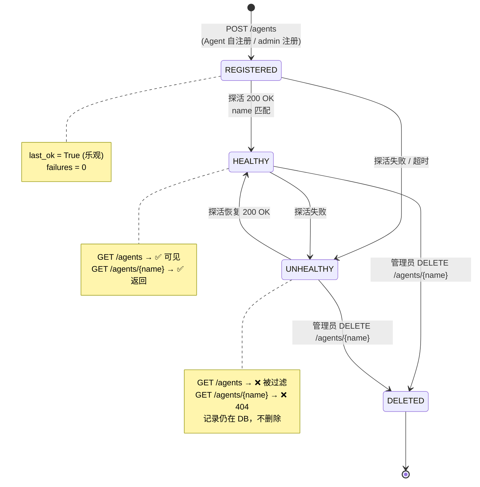
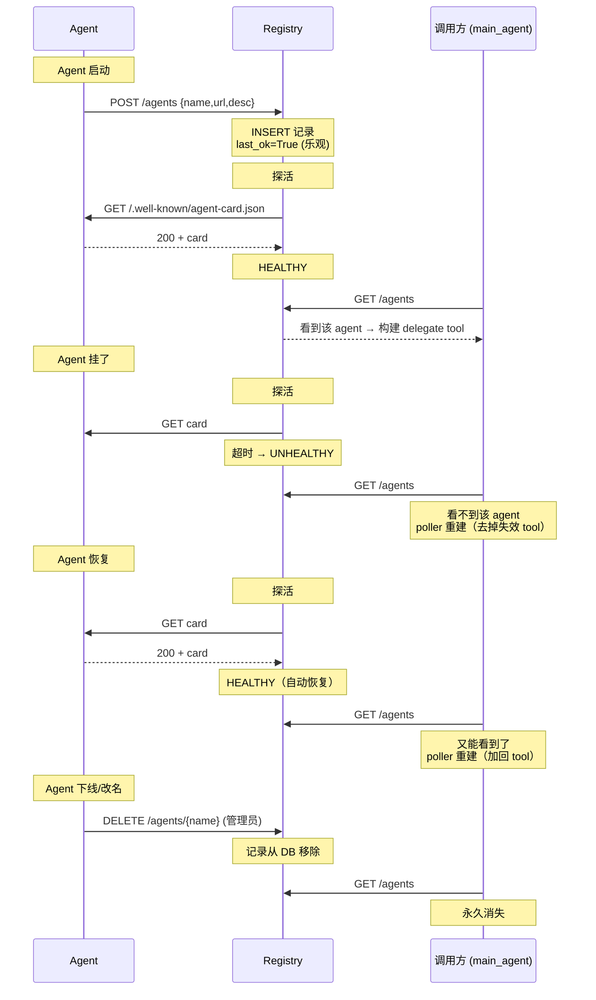
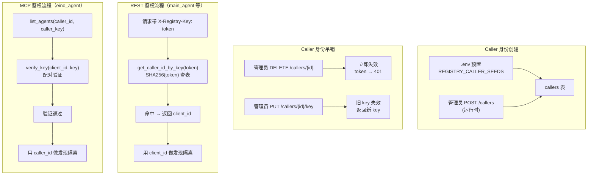
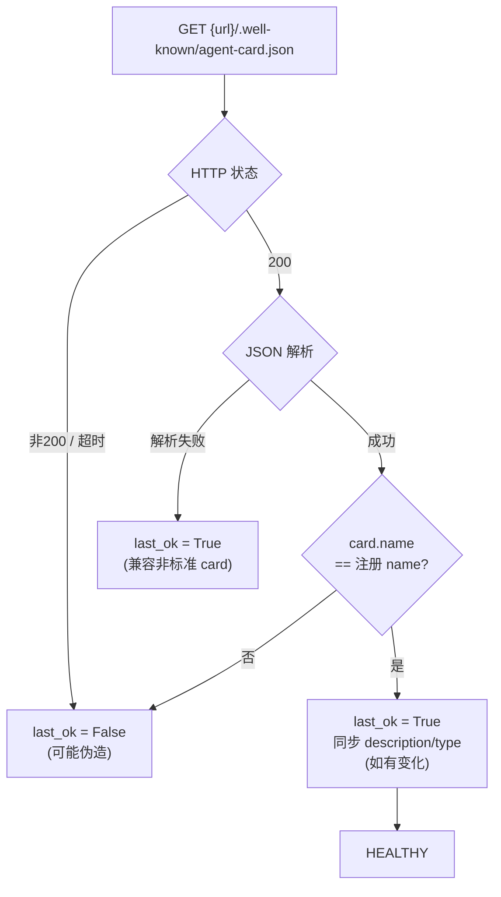

# Agent Registry 状态机与生命周期

> 本文档描述一个 Agent 在 Registry 中的**完整生命周期**：从注册、探活、
> 发现隔离、到注销。每个状态的含义、状态间的转换条件、以及谁触发转换。
>
> 这是设计参考文档，帮助理解 Registry 的行为，以及"Agent 改了名字/地址/
> 描述后该怎么处理"。

---

## 一、Agent 的四个维度

一个 Agent 在 Registry 里由以下字段决定它的"状态"：

| 维度 | 字段 | 谁控制 |
|------|------|--------|
| **身份** | `name` | 注册时确定，是发现隔离和调用的 key |
| **地址** | `url` | 注册时确定，探活和 A2A 调用用这个 |
| **描述** | `description` | 注册时确定，LLM 路由依据 |
| **健康** | `last_ok` + `consecutive_failures` | Registry 自动探活，无人手动改 |
| **可见性** | `allowed_callers` | admin 设置（空=公开） |

---

## 二、健康状态机（Registry 自动管理）

这是最核心的状态机——Registry 每 60 秒自动运转，**无需人工介入**。



### 关键规则

1. **HEALTHY ↔ UNHEALTHY 是自动的**：Registry 探活驱动，无需人工
2. **UNHEALTHY 的记录不会被删**：只是从 `GET /agents` 里隐藏，记录还在 DB
3. **Agent 恢复后自动回到 HEALTHY**：下次探活 200 就回来了
4. **只有 DELETE 才真正移除记录**：这是人工操作（管理员或注册者）

---

## 三、注册状态机（人工/Agent 触发）

```
┌─────────────────────────────────────────────────────────────┐
│                                                             │
│  状态：NOT_REGISTERED（未注册 / 已删除）                      │
│                                                             │
│    │                                                        │
│    │  触发条件                  执行者                       │
│    │  ─────────────────────    ──────────                    │
│    │  Agent 启动时自注册         Agent 自己（带 token）        │
│    │  管理员手动注册             管理员（admin token）         │
│    │                                                        │
│    │  操作：POST /agents                                     │
│    │  body: {name, url, description, type}                  │
│    │                                                        │
│    ├── (name,url) 不存在 ──► 201 REGISTERED                  │
│    │                                                        │
│    └── (name,url) 已存在 ──► 409（重复，不覆盖）             │
│         → Agent 代码应忽略 409（重启时正常）                  │
│                                                             │
└─────────────────────────────────────────────────────────────┘
```

### 注册的幂等性

```
场景：Agent 重启，再次 POST /agents（同样的 name + url）

当前行为：409 Conflict（已存在）
Agent 代码处理：忽略 409，正常继续

问题：如果 Agent 的 url 变了（比如换了端口），
      POST 同名不同 URL → 201（创建新记录，旧的还在）
      → Registry 里出现两条同名记录（不同 URL）

正确做法（如果遇到这种情况）：
  ① 先 DELETE /agents/{name}（删旧的）
  ② 再 POST /agents（注册新的）
  
  或：PUT /agents/{name} 更新 URL（不会产生重复记录）
```

---

## 四、字段变更矩阵（"我改了 X，要做什么？"）

这是最实用的速查表——Agent 的某个属性变了，需要什么操作：

```
┌──────────────────┬─────────────────────┬──────────────────────────────┐
│  改了什么         │  需要操作吗？        │  怎么操作                     │
├──────────────────┼─────────────────────┼──────────────────────────────┤
│                  │                     │                              │
│  description     │  不需要（如果启用了  │  Registry 探活时自动从 card   │
│  （描述）         │  card 自动同步）     │  读取并更新 DB                │
│                  │                     │  【注：此功能待实现】         │
│                  │                     │                              │
├──────────────────┼─────────────────────┼──────────────────────────────┤
│                  │                     │                              │
│  type            │  不需要（如果启用了  │  同上，card 自动同步          │
│  （角色类型）     │  card 自动同步）     │                              │
│                  │                     │                              │
├──────────────────┼─────────────────────┼──────────────────────────────┤
│                  │                     │                              │
│  url             │  ✅ 需要手动更新     │  PUT /agents/{name}          │
│  （地址）         │                     │  body: {"url": "新地址"}     │
│                  │                     │  → 自动重置 last_ok=True     │
│                  │                     │  → 下次探活验证新地址         │
│                  │                     │                              │
├──────────────────┼─────────────────────┼──────────────────────────────┤
│                  │                     │                              │
│  name            │  ✅ 需要手动操作     │  ① DELETE /agents/{旧name}  │
│  （名字）         │  （不能直接改名）    │  ② POST /agents {新name...} │
│                  │                     │                              │
│                  │  原因：name 是主键   │  注意：发现隔离（allowed_    │
│                  │  级标识，改了等于    │  callers）用 name 匹配，     │
│                  │  换了一个新 Agent    │  改名后需要重新配置可见性    │
│                  │                     │                              │
├──────────────────┼─────────────────────┼──────────────────────────────┤
│                  │                     │                              │
│  allowed_callers │  ✅ admin 手动设置  │  PUT /agents/{name}          │
│  （可见性）       │                     │  body: {"allowed_callers":   │
│                  │                     │   ["main_agent"]}            │
│                  │                     │  只有 admin 有权             │
│                  │                     │                              │
└──────────────────┴─────────────────────┴──────────────────────────────┘
```

---

## 五、完整生命周期时间线



---

## 六、鉴权状态机（Caller 身份）

Caller（调用方）的生命周期独立于 Agent：



---

## 七、Agent Card 自动同步（已实现）

> 探活时不只检查 HTTP 200，还解析 card 内容，自动同步 description/type，
> 并验证 name 是否匹配（防伪造）。



**好处**：
- Agent 改了 description（在 `AgentCardBuilder` 或 agent 定义里），不用重新注册
- Registry 下次探活自动同步，调用方 `list_agents` 拿到的始终是最新的
- name 不匹配会被标记不可信（防伪造的额外保护层）

**不影响的**：
- `url` 改了仍然需要 `PUT /agents/{name}`（card 里虽然有 url，但探活用的是 DB 里的 url 去连，不能自举）
- `name` 改了仍然需要删了重建（name 是标识，card 里改了反而会触发"不匹配"）
- `allowed_callers` 仍然需要 admin 手动设

---

## 八、速查：常见场景操作指南

| 场景 | 操作 |
|------|------|
| 新 Agent 要加入集群 | 管理员分配 token → Agent 配好 `REGISTRY_CLIENT_KEY` → Agent 启动自注册 |
| Agent 改了描述 | 什么都不用做（card 自动同步） |
| Agent 换了端口 | `PUT /agents/{name}` body `{"url":"新地址"}` |
| Agent 改了名字 | `DELETE /agents/{旧name}` + `POST /agents` 用新 name |
| Agent 临时下线 | 什么都不用做（探活自动标 UNHEALTHY，恢复后自动回来） |
| Agent 永久下线 | `DELETE /agents/{name}` |
| 限制某 Agent 只被特定 caller 看到 | admin: `PUT /agents/{name}` body `{"allowed_callers":["main_agent"]}` |
| 新增一个 caller 身份 | admin: `POST /callers` |
| 吊销某 caller 的权限 | admin: `DELETE /callers/{client_id}` |
| Registry 重启 | 什么都不用做（DB 持久化在 volume 里，重启自动恢复） |
